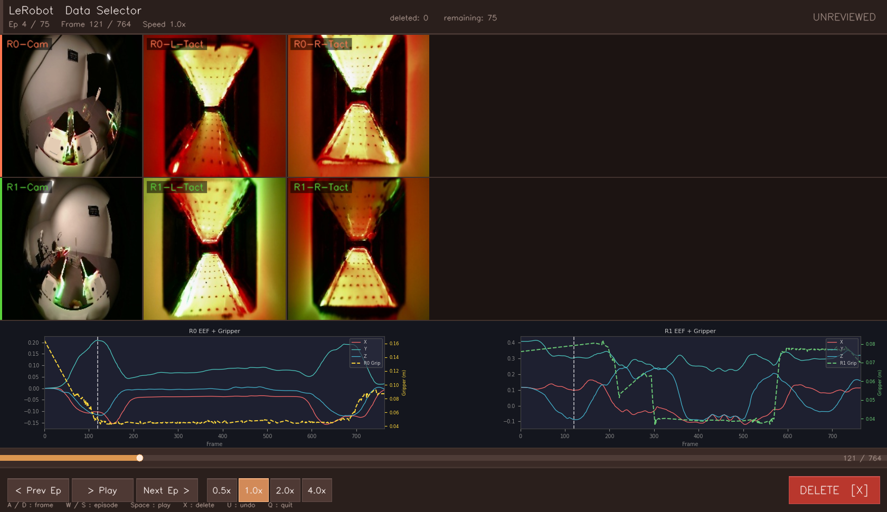

# LeRobot Data Selector

A visualization tool for browsing and filtering [LeRobot](https://github.com/huggingface/lerobot) datasets. Preview camera images and end-effector trajectories episode by episode, and mark episodes for deletion.



## Features

- **Multi-camera view** — displays all available RGB and tactile sensor streams (up to 6 channels), automatically hides empty channels for single-arm datasets
- **Timeseries plots** — EEF position (X/Y/Z) with gripper width overlaid on a secondary axis, for each robot arm
- **Playback controls** — play/pause with adjustable speed (0.5× / 1× / 2× / 4×), frame-by-frame scrubbing, clickable progress bar
- **Episode marking** — mark episodes as deleted with a single keypress or button click
- **Undo** — multi-step undo for all marking actions
- **Export** — saves a `selection.json` on exit listing deleted and unreviewed episode indices

## Supported Dataset Formats

| Format | Structure |
|--------|-----------|
| LeRobot v2.x | `data/chunk-000/episode_000000.parquet` (one file per episode) |
| LeRobot v3.x | `data/chunk-000/file-000.parquet` (multiple episodes per file, grouped by `episode_index`) |

## Installation

```bash
pip install numpy opencv-python pandas pyarrow matplotlib
```

## Usage

```bash
python src/data_selector.py --dataset /path/to/lerobot_dataset
```

Options:

| Flag | Default | Description |
|------|---------|-------------|
| `--dataset` / `-d` | required | Path to the LeRobot dataset root |
| `--start` / `-s` | `0` | Episode index to start from |
| `--output` / `-o` | `selection.json` | Path for the output JSON file |

## Controls

| Key / Action | Function |
|---|---|
| `A` / `D` | Previous / next frame |
| `W` / `S` | Previous / next episode |
| `Space` | Play / pause |
| `X` | Mark current episode as deleted, advance to next |
| `U` | Undo last mark |
| `1` / `2` / `3` / `4` | Set playback speed 0.5× / 1× / 2× / 4× |
| `Q` / `Esc` | Quit and save results |
| Click progress bar | Seek to frame |
| Click speed buttons | Set playback speed |
| Click DELETE button | Mark current episode as deleted |

## Output

On exit, a JSON file is written with the following structure:

```json
{
  "dataset": "/path/to/dataset",
  "total_episodes": 75,
  "deleted": {
    "count": 3,
    "episodes": [2, 14, 37]
  },
  "unreviewed": {
    "count": 72,
    "episodes": [0, 1, 3, ...]
  }
}
```

## Dataset Structure Expected

```
dataset/
├── meta/
│   ├── info.json
│   └── episodes.jsonl   (v2.x only)
└── data/
    └── chunk-000/
        ├── episode_000000.parquet   (v2.x)
        └── file-000.parquet         (v3.x)
```

Each parquet row should contain at least one of:

- `observation.images.camera0` / `camera1` — RGB images (bytes)
- `observation.images.tactile_left_0` / `tactile_right_0` / `_1` — tactile images (bytes)
- `observation.state` — robot state vector (supports 20-dim dual-arm format)
